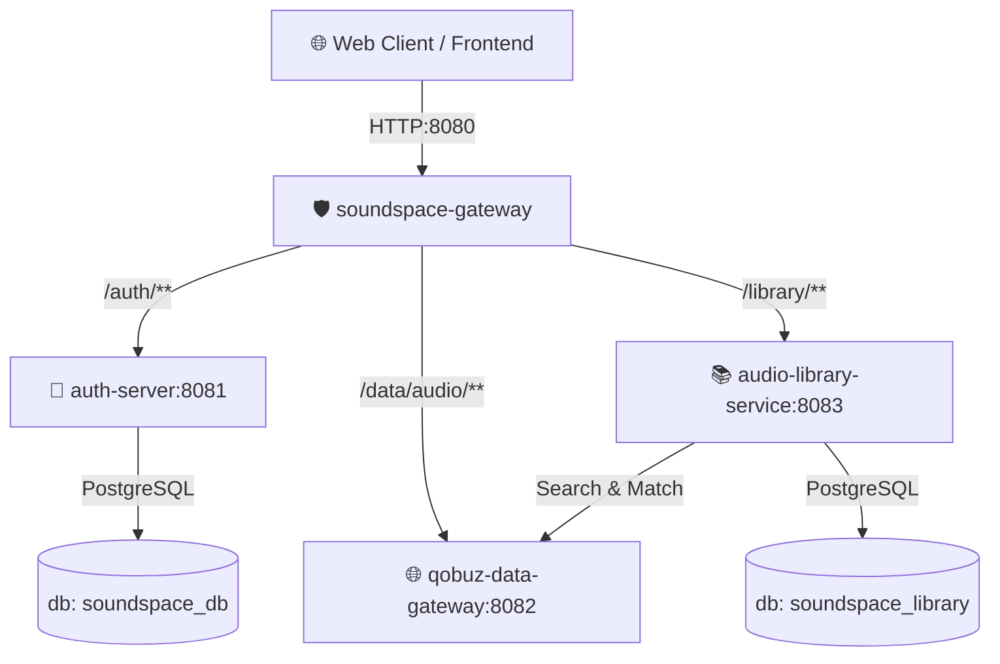

# 🌌 SoundSpace

SoundSpace is a high-performance, microservices-based audio catalog aggregator and personal music library manager. It acts as a smart caching proxy for **Qobuz** and provides automated, non-blocking playlist import pipelines from **YouTube** and **Spotify**.

---

## 🏗️ System Architecture

The application is decomposed into four specialized microservices coordinated via **Docker Compose**:



### Microservices Matrix

| Service | Port | Description | Tech Stack |
| :--- | :---: | :--- | :--- |
| **[soundspace-gateway](file:///./soundspace-gateway)** | `8080` | Central API Gateway. Manages request routing, validates JWT session cookies, and relays the user context to downstream services via `X-User-Id` header. | Spring Cloud Gateway, WebFlux, Spring Security |
| **[auth-server](file:///./auth-server)** | `8081` | Identity Provider. Manages user registration, login, Google OAuth2 integration, JWT generation, and secure Spotify application token exchange. | Spring Boot, JPA, Flyway, PostgreSQL |
| **[qobuz-data-gateway](file:///./qobuz-data-gateway)** | `8082` | Qobuz API Proxy & BFF. Signs outbound requests with custom cryptographic hashes, streams audio files, caches metadata, and serves the static frontend. | Spring Boot, WebFlux (WebClient), Caffeine Cache |
| **[audio-library-service](file:///./audio-library-service)** | `8083` | User Library Engine. Manages user-specific tracks, albums, artists, and playlists. Coordinates asynchronous multi-threaded import operations. | Spring Boot, JPA, Flyway, PostgreSQL |

---

## ✨ Core Features

* **Reactive & Non-Blocking Backend:** Built entirely on Spring WebFlux and WebClient for high throughput and low resource utilization.
* **Smart Qobuz Proxying:** Outbound Qobuz requests are cryptographically signed, structured, and local results are cached in-memory using **Caffeine Cache** to stay within API rate limits.
* **Automated Playlist Imports:**
  * **YouTube:** Fetches playlist videos via Google APIs, normalizes titles (stripping noise like `(Official Video)`), splits strings to isolate artists/tracks, and performs text-based heuristic matching.
  * **Spotify:** Redesigned to run securely on the server via **Client Credentials Flow** (no user login required, only public link/ID is needed). Uses **ISRC codes** (`external_ids.isrc`) for exact, 100% accurate track matching in Qobuz.
* **Unified Security Model:** Centralized cookie-based JWT authorization handled at the gateway. Downstream services remain stateless and trust the gateway-injected `X-User-Id` UUID header.
* **Concurrent Execution:** Track matching and database persistence run in parallel using a dedicated thread pool executor via Spring `@Async` and `CompletableFuture`.

---

## 🛠️ Technology Stack

* **Language:** Java 17
* **Build System:** Maven
* **Core Framework:** Spring Boot 3.4.x, Spring Cloud Gateway, Spring Security
* **Databases:** PostgreSQL (2 isolated schemas: `soundspace_db` and `soundspace_library`)
* **Database Migrations:** Flyway
* **In-Memory Caching:** Caffeine Cache
* **Containerization:** Docker, Docker Compose

## 🚀 Deployment

Launch the containerized microservices stack:
```bash
docker compose up -d --build
```

The application frontend will be accessible at `http://localhost:8080` (or the configured gateway hostname).

---

## 🔒 Security & Route Mapping

The **soundspace-gateway** (`PORT 8080`) handles all incoming client requests and securely forwards them:

| Route Path | Destination Service | Internal Port | Context |
| :--- | :--- | :---: | :--- |
| `/auth/**` | `auth-server` | `8081` | Authentication & OAuth configurations |
| `/data/audio/**` | `qobuz-data-gateway` | `8082` | Metadata retrieval and audio streaming |
| `/library/**` | `audio-library-service` | `8083` | Playlists and user library modifications |
| `/` | `qobuz-data-gateway` | `8082` | Serves index.html and static UI resources |

The custom `UserIdRelayFilter` extracts the user ID from the encrypted session cookie, constructs a secure `X-User-Id` header, and drops it into the downstream request chain, ensuring strict multi-tenant data isolation.